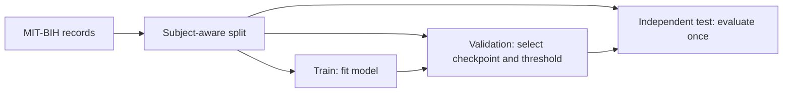

# ECG anomaly detection with a spiking neural network — research prototype

MIT-BIH ECG beatsを用い、時間軸SNNとCNNベースラインを比較する研究試作です。Graded Delta encoding、クラス不均衡、閾値選択、計算量を検討しました。

**Status (2026-09-23): historical experimentはFold 0のみ。目標の同時達成は確認できません。5-fold全体、独立testによる再評価、STDP/ノイズ/アブレーションの実証は未完了です。評価分割コードを修正しましたが、修正後のモデルは再学習・再評価していません。**  
**Stack:** Python, PyTorch, snnTorch, WFDB, scikit-learn.  
**Results:** [historical summary](results/final_results_summary.md) / [CSV](results/core_evaluation_summary.csv) / [result provenance](results/README.md).  
**Visuals:** [encoding](results/ecg_encoding_comparison.png) / [historical confusion matrices](results/confusion_matrices.png)（対応する実行を再検証していない図は性能の証拠とみなさない）。

## What was observed

既存の`core_evaluation_summary.csv`と`final_results_summary.md`は、同じ**歴史的なFold 0のvalidation上の閾値調整結果**として次の値を報告します。閾値も最終指標も同じvalidationから得たため、独立testの汎化性能ではありません。

| Model | Threshold | Sensitivity | Specificity | Macro F1 | 判定 |
| --- | ---: | ---: | ---: | ---: | --- |
| SNN | 0.2109 | 0.8085 | 0.2756 | 0.2282 | 3目標の同時達成なし |
| CNN | 0.0059 | 0.8085 | 0.7759 | 0.4742 | 3目標の同時達成なし |

`final_report_revised.md`は同じFold 0についてSNN閾値0.0000・Specificity 0.521・Macro F1 0.361を記し、上表と整合しません。来歴を確定できないため**historical / inconsistent**として残し、上表と混ぜて解釈しません。SOPs、STDP、ノイズの図や文章にも異なる実行・未完了の記述があり、現時点で省電力性や適応能力を実証済みとは主張しません。[詳細](results/README.md)

## Evaluation design

旧スクリプトは全recordを混ぜてk-foldし、同じvalidationでモデル・閾値を選び最終指標を算出していました。さらに[PhysioNetのMIT-BIH directory](https://physionet.org/physiobank/database/html/mitdbdir/intro.htm)によるとrecords **201と202は同一被験者**ですが、旧`config.yaml`は201をtrain、202をtestに置きます。

新しい[`src/train_corrected_protocol.py`](src/train_corrected_protocol.py)は、元の設定を歴史資料として残しつつ、202を独立testから除外します。train pool内を被験者単位でtrain / validationに分け、validationでcheckpointとthresholdを選び、独立testは最後に一度だけ評価します。分割の重複は[`src/evaluation_protocol.py`](src/evaluation_protocol.py)で検出します。**この修正後プロトコルは未実行で、新しい性能値はありません。** 旧`src/train_final_optimized.py`等は再現用の歴史的コードであり、新しい汎化性能の根拠にしません。



## Repository structure

- `src/data_loader.py`: beat抽出とGraded Delta encoding。旧`StratifiedPatientKFold`は名前に反してrecord単位の歴史的実装です。
- `src/train_corrected_protocol.py` / `src/evaluation_protocol.py`: 未実行の修正後評価手順。
- `src/train_final_optimized.py`等: 歴史的な試行コード。設定・評価方法に差があるため、報告値と一対一で対応すると仮定しないでください。
- `config/config.yaml`: 旧実験の設定。201/202の被験者重複を含みます。
- `models/`: 旧チェックポイント。再学習や再評価による照合は未実施。
- `results/`: CSV、図、矛盾を含む旧レポート。読む順序は[`results/README.md`](results/README.md)。

## Setup and checks

Python環境とMIT-BIHデータ取得手順は[`LOCAL_SETUP_GUIDE.md`](LOCAL_SETUP_GUIDE.md)。repoのrootから実行してください。GPUや大きなデータ取得を伴わない分割テストと構文検査:

```bash
python -m unittest discover -s tests
python -m compileall -q src tests
```

修正後の学習・独立test評価はデータとPyTorch環境を用意した場合のみ `python src/train_corrected_protocol.py` で実行できます。実行すると長時間の学習が発生します。歴史的な結果を更新するには、依存バージョン、実行ログ、分割したrecord、checkpoint、CSVを一緒に保存してください。このREADME時点では実行していません。

## Limitations and provenance

- 目標はSensitivity ≥ 0.80、Specificity ≥ 0.90、Macro F1 ≥ 0.75。既存結果は同時に達成していません。
- `data_loader.py`は注釈symbolが正常集合以外なら異常にする簡略化した二値分類です。非beat注釈の扱いも再検証が必要です。
- 公開レポートには`Manus AI`作成の表記があります。AIが生成した文章を実験実施の証拠とは扱わず、本人が再検証した範囲だけを確定結果とします。
- [MIT-BIH Arrhythmia Database](https://physionet.org/content/mitdb/1.0.0/)はPhysioNetによるOpen Data Commons Attribution License v1.0です。元データの利用・再配布時は同ライセンスに従ってください。医療機器としての利用を想定した性能・省電力性は検証されていません。
