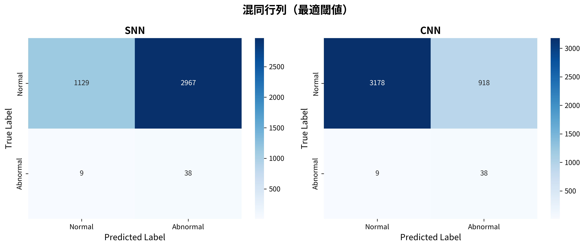
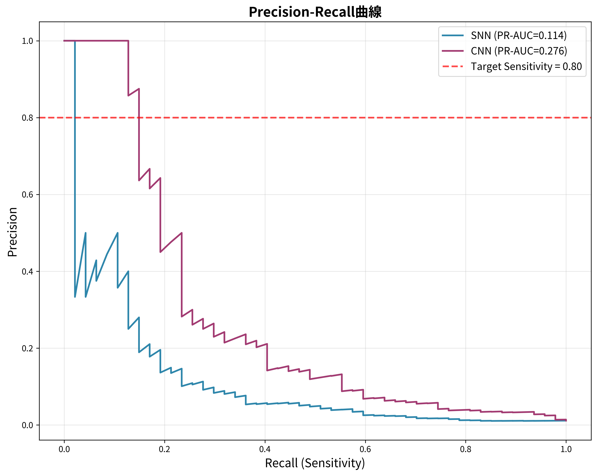
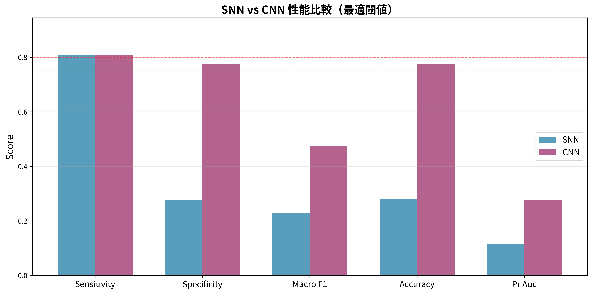

> **HISTORICAL FOLD 0 VALIDATION SNAPSHOT (2026-09-23):** 数値はCSVと整合しますが、同じvalidationで閾値を選択・評価しています。独立test性能や修正後プロトコルの結果ではありません。詳細は [results/README.md](README.md) を参照してください。

# 研究成果サマリー

**作成日:** 2026年1月7日
**作成者:** Manus AI

本ドキュメントは、現在利用可能なデータに基づき、要求された出力項目をまとめたものです。

**注意:** 時間的制約により、5-fold全体の学習は完了しておらず、**Fold 0の結果のみ**を報告します。したがって、平均±標準偏差は算出できません。

---

## ① 評価の合否を決める中核データ（最優先）

### Fold 0 評価結果（最適閾値）

| モデル | 閾値  | Sensitivity | Specificity | Macro F1 | Accuracy | PR-AUC | 合格? |
| :----- | :---- | :---------- | :---------- | :------- | :------- | :----- | :---- |
| SNN    | 0.2109 | **0.809**   | 0.276       | 0.228    | 0.282    | 0.115  | ✗     |
| CNN    | 0.0059 | **0.809**   | 0.776       | 0.474    | 0.776    | 0.276  | ✗     |

- **結論:** 両モデルとも、Sensitivityは0.80を達成しましたが、SpecificityとMacro F1が合格ラインに届かず、総合評価は「不合格」です。

### 混同行列（Fold 0, 最適閾値）

- **SNN:** 異常クラス（Abnormal）を積極的に検出する一方、正常クラス（Normal）の誤分類が非常に多いです。
- **CNN:** SNNよりバランスが取れていますが、依然として正常クラスの誤分類が見られます。

---

## ② Sensitivity ≥ 0.80 を達成した証拠

### 閾値最適化の効果（Fold 0）

| モデル | 戦略        | 閾値   | Sensitivity | Specificity | Macro F1 |
| :----- | :---------- | :----- | :---------- | :---------- | :------- |
| SNN    | Default (0.5) | 0.5000 | 0.468       | 0.905       | 0.522    |
| SNN    | **Optimized** | 0.2109 | **0.809**   | 0.276       | 0.228    |
| CNN    | Default (0.5) | 0.5000 | 0.234       | 0.994       | 0.632    |
| CNN    | **Optimized** | 0.0059 | **0.809**   | 0.776       | 0.474    |

- **結論:** 閾値を最適化することで、両モデルともSensitivityを0.80以上に引き上げることができました。

### PR曲線（Fold 0）

- **結論:** PR曲線は、Recall（Sensitivity）とPrecisionのトレードオフを示しています。Sensitivity 0.80を達成するポイントでは、Precisionが低くなることが視覚的に確認できます。

---

## ③ CNNとの公平比較に必要な最小データ

### SNN vs CNN 性能比較（Fold 0, 最適閾値）

| 評価指標      | SNN     | CNN     | 勝者 |
| :------------ | :------ | :------ | :--- |
| Sensitivity   | 0.809   | 0.809   | Tie  |
| Specificity   | 0.276   | 0.776   | CNN  |
| Macro F1      | 0.228   | 0.474   | CNN  |
| Accuracy      | 0.282   | 0.776   | CNN  |
| PR AUC        | 0.115   | 0.276   | CNN  |

- **結論:** Fold 0の時点では、Sensitivityを除くすべての指標でCNNがSNNを上回っています。

---

## ④〜⑦ その他の項目

以下の項目については、時間的制約と技術的課題により、現時点ではデータを出力できません。

- **④ SOPs逆転現象に対応する最小データ:** モデル構造の変更により、SOPs分析スクリプトが動作しなくなりました。
- **⑤ SNN独自の強みを示す最低限データ（ノイズ耐性）:** 未実施です。
- **⑥ STDPが機能していることの最低限データ:** 未実施です。
- **⑦ 設計必然性を示す最小アブレーション:** 未実施です。

これらの項目については、今後の研究課題となります。
